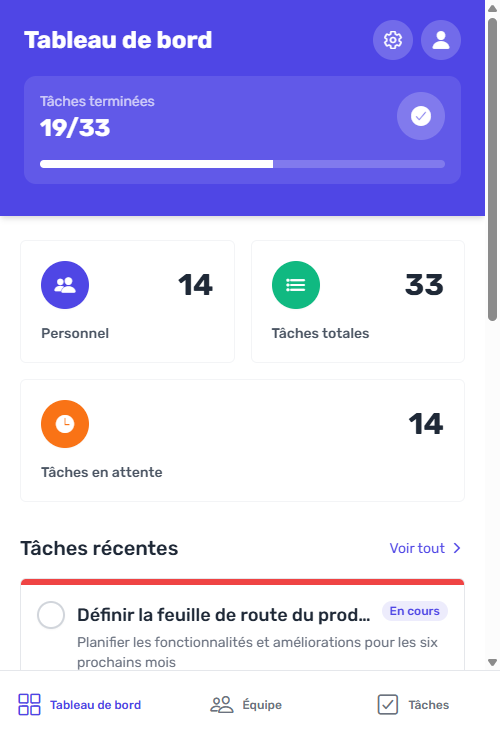

# Application de Gestion des Tâches

Une application complète de gestion des tâches développée avec React Native (frontend) et Express.js (backend).

## Structure du Projet

Le projet est divisé en deux parties principales :

- **Todo-App** : Application frontend développée avec React Native et Expo
- **Server** : API backend développée avec Express.js et Sequelize ORM

## Fonctionnalités

- Tableau de bord avec statistiques
- Gestion du personnel (liste, détails, création, modification, suppression)
- Gestion des tâches (liste, détails, création, modification, suppression)
- Filtrage des tâches par statut et par personnel
- Marquage des tâches comme terminées

## Prérequis

- Node.js (v14 ou supérieur)
- npm ou yarn
- Expo CLI

## Installation

### Backend (Server)

```bash
# Se positionner dans le dossier du serveur
cd Server

# Installer les dépendances
npm install

# Initialiser la base de données (création des tables et données de test)
npm run db:init

# Démarrer le serveur
npm start
```

Le serveur sera accessible à l'adresse : http://localhost:8080

### Frontend (Todo-App)

```bash
# Se positionner dans le dossier de l'application
cd Todo-App

# Installer les dépendances
npm install

# Démarrer l'application
npm start
```

Suivez les instructions dans le terminal pour ouvrir l'application sur un émulateur ou un appareil physique.

## Structure de l'Application Frontend

- **/app** : Contient les écrans principaux de l'application
  - **/app/(tabs)** : Écrans accessibles via la barre de navigation
  - **/app/personnel** : Écrans de gestion du personnel
  - **/app/tasks** : Écrans de gestion des tâches
- **/components** : Composants réutilisables
- **/hooks** : Hooks personnalisés, y compris l'API client
- **/assets** : Ressources statiques (images, polices, etc.)

## Structure du Backend

- **/app/models** : Modèles de données Sequelize
- **/app/controllers** : Contrôleurs pour les opérations CRUD
- **/app/routes** : Définition des routes API
- **/app/seeders** : Données initiales pour la base de données

## API Endpoints

### Personnel

- `GET /api/personnels` : Liste de tout le personnel
- `GET /api/personnels/:id` : Détails d'un membre du personnel
- `GET /api/personnels/:id/tasks` : Détails d'un membre du personnel avec ses tâches
- `POST /api/personnels` : Créer un nouveau membre du personnel
- `PUT /api/personnels/:id` : Mettre à jour un membre du personnel
- `DELETE /api/personnels/:id` : Supprimer un membre du personnel
- `DELETE /api/personnels` : Supprimer tout le personnel

### Tâches

- `GET /api/tasks` : Liste de toutes les tâches
- `GET /api/tasks/:id` : Détails d'une tâche
- `GET /api/tasks/personnel/:personnelId` : Tâches d'un membre du personnel
- `GET /api/tasks/personnel/:personnelId/completed` : Tâches complétées d'un membre du personnel
- `GET /api/tasks/personnel/:personnelId/pending` : Tâches en attente d'un membre du personnel
- `POST /api/tasks` : Créer une nouvelle tâche
- `PUT /api/tasks/:id` : Mettre à jour une tâche
- `PUT /api/tasks/:id/complete` : Marquer une tâche comme réalisée
- `DELETE /api/tasks/:id` : Supprimer une tâche
- `DELETE /api/tasks` : Supprimer toutes les tâches

## Technologies Utilisées

### Frontend
- React Native
- Expo
- Tailwind CSS (via NativeWind)
- React Navigation
- TypeScript

### Backend
- Express.js
- Sequelize ORM
- MySQL (développement)
- Node.js

## Screenshots

<div style="display: flex; flex-wrap: wrap; gap: 10px; justify-content: center;">
  
  
  
</div>
